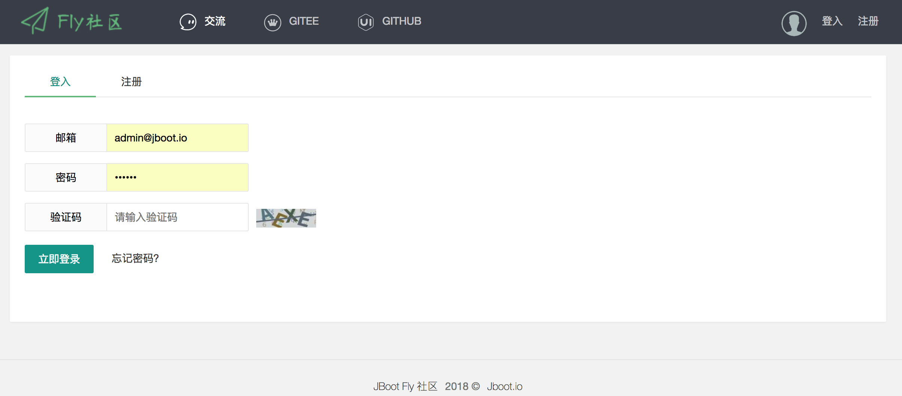
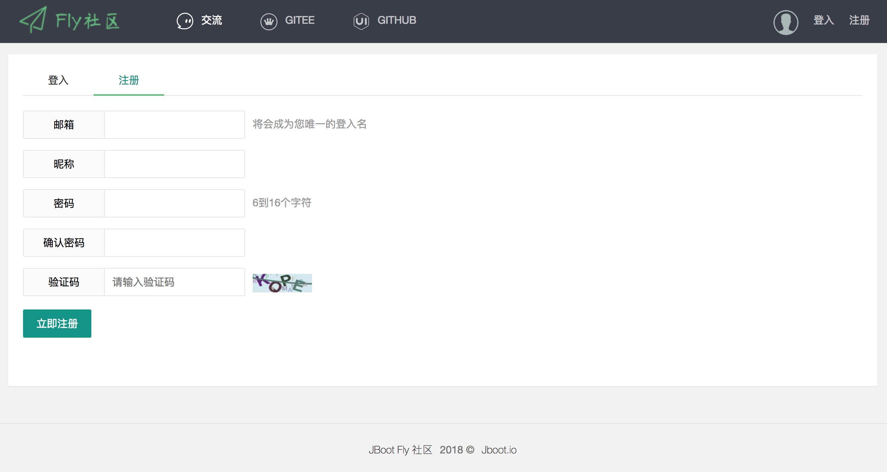
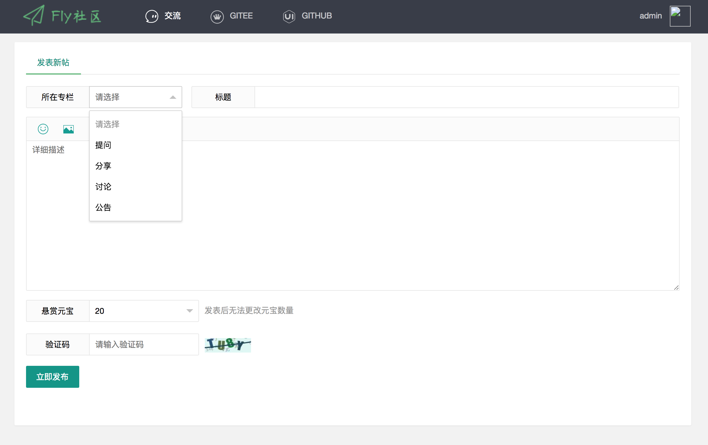
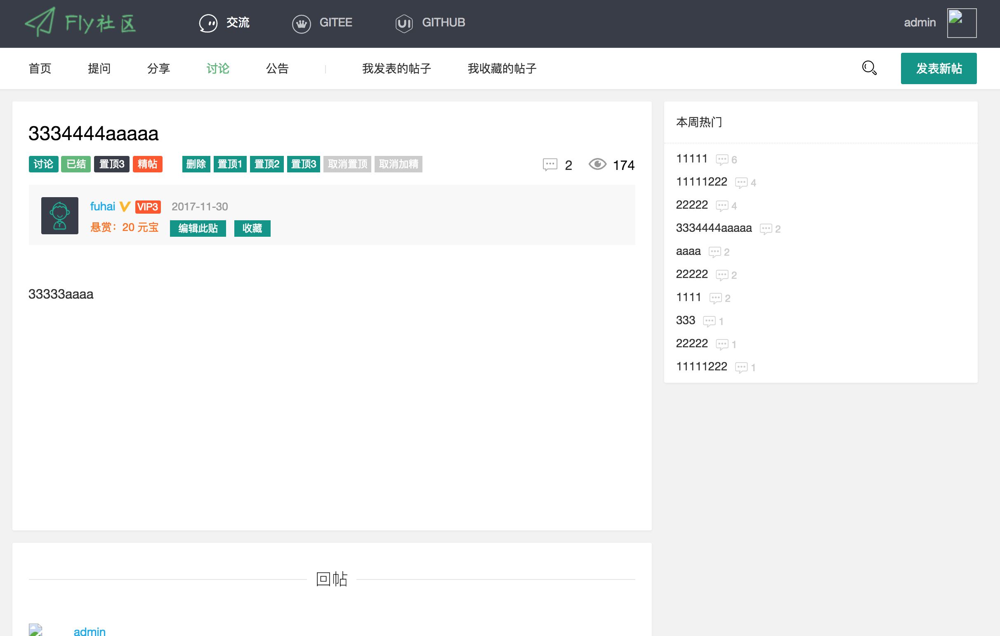
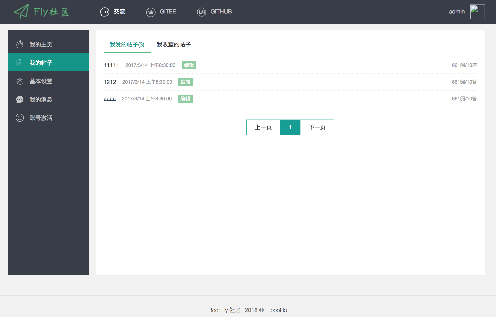
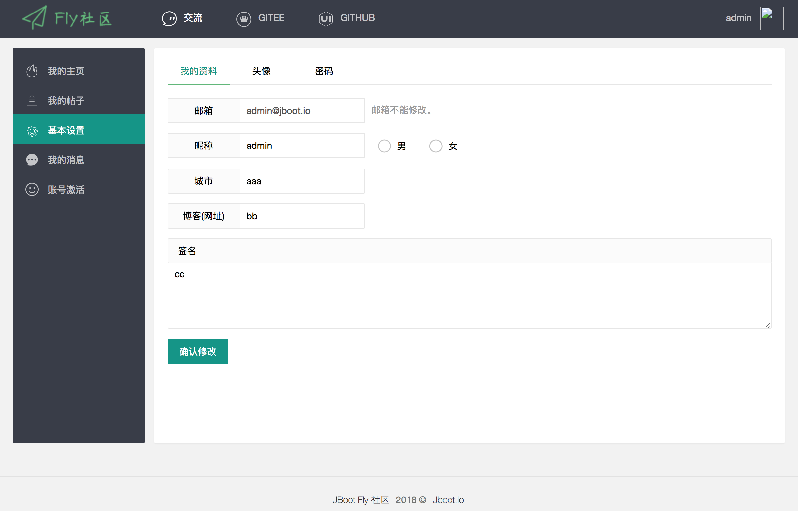
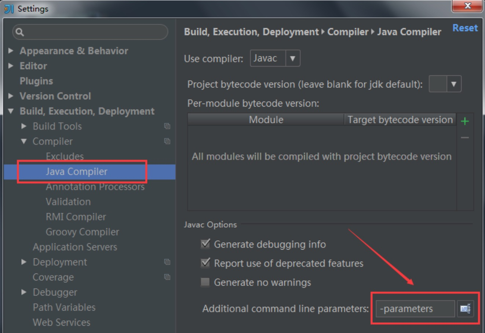
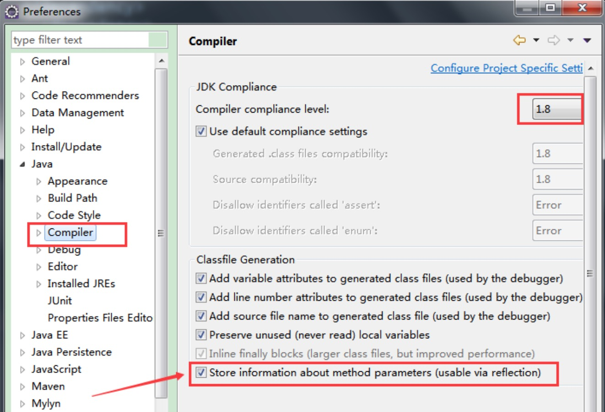

## 简介
JbootFly 是一个由 Jboot + Fly（一个html模板，网址：http://www.layui.com/template/fly/ ）开发的社区。

## 运行
* 请先在数据库上 建表和插入数据，sql在resource下JbootFly.sql.
* 配置 jboot.properties 文件的数据库账号密码
* 运行 App.java 的 main 方法启动

## 其他
* 默认 admin@jboot.io 为管理员，密码是 111111
* 管理员（user表role字段为 admin 的）可以对任意帖子进行置顶、推荐、编辑、删除等
* 管理员 可以激活其他成员，激活页面在用户中心里

## JbootFly 截图

登陆

注册

首页

发布新帖子

帖子详情

个人中心（我的帖子）

个人中心（设置）

## 注意
如果导入 idea 运行，请注意配置如下配置：

如果导入Eclipse运行，请注意配置如下配置：
